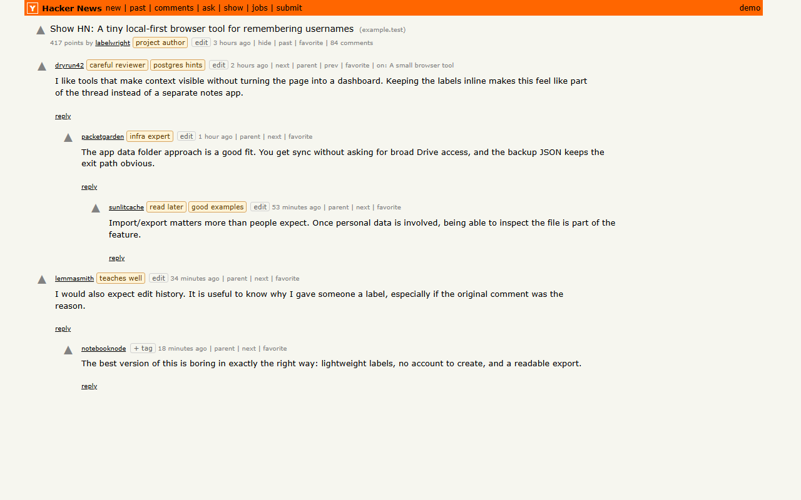

# HN Labels

HN Labels is a Chrome extension for adding private, persistent labels to Hacker News users.

Labels appear next to matching usernames across Hacker News. Each label edit is saved with a small history record, including when the edit happened and which HN page it came from.



## Features

- Add personal labels beside Hacker News usernames.
- See saved labels anywhere the same username appears on HN.
- Click labels to view and edit label history.
- Store labels locally for fast rendering and offline use.
- Optionally sync data through the user's private Google Drive `appDataFolder`.
- Export and import JSON backups from the toolbar popup.

## Install From Source

1. Clone this repository.
2. Open Chrome and go to `chrome://extensions`.
3. Enable **Developer mode**.
4. Click **Load unpacked**.
5. Select the repository root, the folder containing `manifest.json`.
6. Visit [Hacker News](https://news.ycombinator.com/) and use the `+ tag` control beside a username.

Google Drive sync requires a valid OAuth client. If the bundled OAuth client is not available to your Google account, create your own client and update `manifest.json`.

## Google Drive Sync

Drive sync uses Chrome's built-in `chrome.identity` API and the Google Drive API. The extension does not load remote code.

The requested Drive scope is:

```text
https://www.googleapis.com/auth/drive.appdata
```

That scope limits the extension to its private app data folder in the user's Google Drive. The synced file is named `hn-labels-data.json`.

To configure a new OAuth client:

1. Create or select a Google Cloud project.
2. Enable the Google Drive API.
3. Configure the OAuth consent screen.
4. Create an OAuth client with application type **Chrome Extension**.
5. Use the Chrome extension item ID as the OAuth client item/application ID.
6. Copy the generated client ID into `manifest.json`:

   ```json
   "oauth2": {
     "client_id": "YOUR_CLIENT_ID.apps.googleusercontent.com",
     "scopes": ["https://www.googleapis.com/auth/drive.appdata"]
   }
   ```

For stable unpacked-extension testing, add the Chrome Web Store item's public key to `manifest.json` as `"key"`. That makes the unpacked extension ID match the Web Store item ID used by the OAuth client.

## Data And Privacy

HN Labels stores:

- Hacker News usernames you label.
- The labels you assign.
- Edit timestamps.
- The HN page URL and title where each edit happened.
- Google Drive sync status, if Drive sync is enabled.

Data is stored in `chrome.storage.local`. If Drive sync is connected, the same label data is also stored in the user's Google Drive `appDataFolder`.

See [PRIVACY.md](PRIVACY.md) for the privacy policy text.

## Import And Export

The toolbar popup includes JSON backup controls:

- **Export JSON** downloads a backup of labels and edit history.
- **Import JSON** validates and merges a backup into local data.

Import is merge-only. It does not clear existing labels.

## Development

There is no build step for the extension itself. Chrome loads the files directly from the repository.

Run JavaScript syntax checks:

```powershell
node --check src\shared\data.js
node --check src\content.js
node --check src\background.js
node --check src\popup.js
```

Generate Chrome Web Store screenshots with fake HN data:

```powershell
node tools\generate-screenshots.js
```

Screenshots are written to `assets\screenshots`.

Create an upload zip:

```powershell
Compress-Archive -LiteralPath @('manifest.json','src','icons','README.md','PRIVACY.md') -DestinationPath dist\hn-labels-0.1.0.zip -Force
```

## Project Layout

- `manifest.json`: Chrome extension manifest, permissions, OAuth scope, popup, and background worker.
- `src/shared/data.js`: Shared data normalization, merge, and history helpers.
- `src/content.js`: Finds HN user links, renders labels/history, and sends edits to the background worker.
- `src/background.js`: Owns local cache, Drive OAuth, Drive API reads/writes, and merge logic.
- `src/popup.html`, `src/popup.css`, `src/popup.js`: Toolbar popup for Drive sync, import, export, and status.
- `src/content.css`: Inline HN page styles for labels and popovers.
- `tools/generate-screenshots.js`: Fake-data screenshot generator for Chrome Web Store assets.
- `PRIVACY.md`: Privacy policy.
